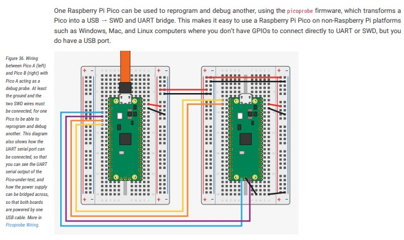

# pico-uart-cpp
RPi Pico app with c++ that's generated by **RPi Pico Project Generator**.

## 1. Setup
Generate RPi project:

```sh
$ export PICO_SDK_PATH=~/workspace_arm/pico-sdk

$ cd ~/workspace_arm/
$ git clone https://github.com/raspberrypi/pico-project-generator.git
$ cd ~/workspace_arm/pico-project-generator
$ sudo apt install -y python3.8-tk
$ ./pico_project.py --gui &
```


Build the project:

```sh
$ cd ~/workspace_arm/pico-uart-cpp
$ mkdir build
$ cd build/
/build$ cmake --version
cmake version 3.14.6
CMake suite maintained and supported by Kitware (kitware.com/cmake).
/build$ cmake ..
/build$ make -j8
/build$ ll
total 1396
drwxr-xr-x 7 ryan ryan   4096 Sep 24 19:41 ./
drwxr-xr-x 5 ryan ryan   4096 Sep 24 19:38 ../
-rw-r--r-- 1 ryan ryan  18608 Sep 24 19:40 CMakeCache.txt
drwxr-xr-x 5 ryan ryan   4096 Sep 24 19:41 CMakeFiles/
-rw-r--r-- 1 ryan ryan  84212 Sep 24 19:40 Makefile
-rw-r--r-- 1 ryan ryan   1577 Sep 24 19:18 cmake_install.cmake
drwxr-xr-x 6 ryan ryan   4096 Sep 24 19:41 elf2uf2/
drwxr-xr-x 3 ryan ryan   4096 Sep 24 19:18 generated/
drwxr-xr-x 6 ryan ryan   4096 Sep 24 19:40 pico-sdk/
-rwxr-xr-x 1 ryan ryan  30476 Sep 24 19:41 pico-uart-cpp.bin*
-rw-r--r-- 1 ryan ryan 473296 Sep 24 19:41 pico-uart-cpp.dis
-rwxr-xr-x 1 ryan ryan 341120 Sep 24 19:41 pico-uart-cpp.elf*
-rw-r--r-- 1 ryan ryan 289469 Sep 24 19:41 pico-uart-cpp.elf.map
-rw-r--r-- 1 ryan ryan  85794 Sep 24 19:41 pico-uart-cpp.hex
-rw-r--r-- 1 ryan ryan  61440 Sep 24 19:41 pico-uart-cpp.uf2
drwxr-xr-x 3 ryan ryan   4096 Sep 24 19:41 pioasm/

# Add debug symbols
/build$ cmake -DCMAKE_BUILD_TYPE=Debug ..
/build$ make -j8

$ src/openocd -f interface/picoprobe.cfg -f target/rp2040.cfg -s tcl
$ sudo apt install gdb-multiarch

/build$ gdb-multiarch pico-uart-cpp.elf
(gdb) monitor reset init
(gdb) continue

```

[disassembled result](build/pico-uart-cpp.dis)

### File type
|File extension |Description|
| :--- | :--- |
|.bin |Raw binary dump of the program code and data|
|.elf |The full program output, possibly including debug information|
|.uf2 |The program code and data in a UF2 form that you can drag-and-drop on to the RP2040
board when it is mounted as a USB drive|
|.dis |A disassembly of the compiled binary|
|.hex |Hexdump of the compiled binary|
|.map |A map file to accompany the .elf file describing where the linker has arranged segments
in memory|

## 2. Using Picoprobe



### Build OpenOCD
For picoprobe to work, you need to build openocd with <ins>the picoprobe driver enabled</ins>.

```sh
$ sudo apt install -y automake autoconf build-essential texinfo libtool libftdi-dev libusb-1.0-0-dev
$ cd ~/workspace_arm/

$ git clone https://github.com/raspberrypi/openocd.git --branch rp2040 --depth=1 --no-single-branch
$ cd openocd/
$ ./bootstrap 
$ ./configure --enable-picoprobe
$ make -j8
$ sudo make install
```

### Build `picoprobe`
```sh
$ export PICO_SDK_PATH=~/workspace_arm/pico-sdk
$ cd ~/workspace_arm/

$ git clone https://github.com/raspberrypi/picoprobe.git
$ cd picoprobe/
$ cp ~/workspace_arm/pico-sdk/external/pico_sdk_import.cmake ./

# Build
$ mkdir build
$ cd build/
/build$ cmake ..
/build$ make -j8
/build$ ll picoprobe.uf2 
-rw-r--r-- 1 ryan ryan 48128 Sep 25 05:07 picoprobe.uf2

# Install picoprobe.uf2 into RPi Pico A
/build$ cp picoprobe.uf2 /media/user/RPI-RP2/
```

### Install `minicom`
```sh
$ sudo apt install -y minicom
$ sudo minicom -D /dev/ttyACM0 -b 115200
```

## 3. Using `picotool`
```sh
$ sudo apt install libusb-1.0-0-dev
$ export PICO_SDK_PATH=~/workspace_arm/pico-sdk
$ cd ~/workspace_arm/
$ git clone -b master https://github.com/raspberrypi/picotool.git
$ cd picotool
$ cp ~/workspace_arm/pico-sdk/external/pico_sdk_import.cmake ./

# Build
$ mkdir build
$ cd build/
/build$ cmake ..
/build$ make -j8
/build$ ll
-rwxr-xr-x 1 ryan ryan 396176 Sep 25 05:25 picotool*
/build$ sudo cp ./picotool /usr/bin/

# sample commands
$ picotool info --pins pico-uart-cpp.elf
File pico-uart-cpp.elf:

Fixed Pin Information
 0:  UART0 TX
 1:  UART0 RX

$ picotool info -a pico-uart-cpp.uf2 
File pico-uart-cpp.uf2:

Program Information
 name:          pico-uart-cpp
 version:       0.1
 features:      UART stdin / stdout
 binary start:  0x10000000
 binary end:    0x1000770c

Fixed Pin Information
 0:  UART0 TX
 1:  UART0 RX

Build Information
 sdk version:       1.4.0
 pico_board:        pico
 boot2_name:        boot2_w25q080
 build date:        Sep 24 2022
 build attributes:  Debug
```