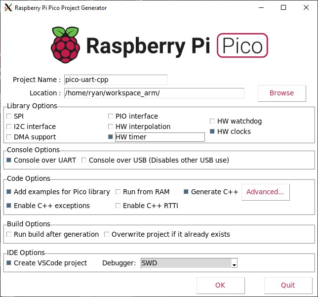
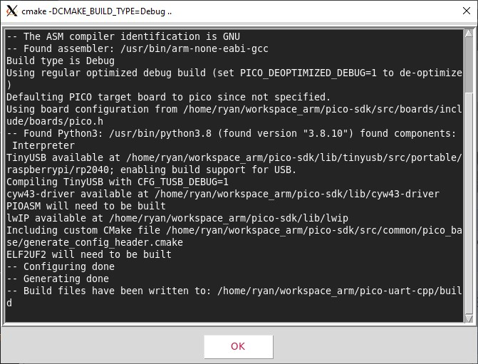

# pico-uart-cpp
RPi Pico app with c++ that's generated by **RPi Pico Project Generator**.

## 1. Setup
Generate RPi project:

```sh
$ export PICO_SDK_PATH=~/workspace_arm/pico-sdk

$ cd ~/workspace_arm/
$ git clone https://github.com/raspberrypi/pico-project-generator.git
$ cd ~/workspace_arm/pico-project-generator
$ sudo apt install -y python3.8-tk
$ ./pico_project.py --gui &
```




Build the project:

```sh
$ cd ~/workspace_arm/pico-uart-cpp
$ mkdir build
$ cd build/
$ cmake --version
cmake version 3.14.6
CMake suite maintained and supported by Kitware (kitware.com/cmake).
$ cmake ..
$ make -j8
/build$ ll
total 1396
drwxr-xr-x 7 ryan ryan   4096 Sep 24 19:41 ./
drwxr-xr-x 5 ryan ryan   4096 Sep 24 19:38 ../
-rw-r--r-- 1 ryan ryan  18608 Sep 24 19:40 CMakeCache.txt
drwxr-xr-x 5 ryan ryan   4096 Sep 24 19:41 CMakeFiles/
-rw-r--r-- 1 ryan ryan  84212 Sep 24 19:40 Makefile
-rw-r--r-- 1 ryan ryan   1577 Sep 24 19:18 cmake_install.cmake
drwxr-xr-x 6 ryan ryan   4096 Sep 24 19:41 elf2uf2/
drwxr-xr-x 3 ryan ryan   4096 Sep 24 19:18 generated/
drwxr-xr-x 6 ryan ryan   4096 Sep 24 19:40 pico-sdk/
-rwxr-xr-x 1 ryan ryan  30476 Sep 24 19:41 pico-uart-cpp.bin*
-rw-r--r-- 1 ryan ryan 473296 Sep 24 19:41 pico-uart-cpp.dis
-rwxr-xr-x 1 ryan ryan 341120 Sep 24 19:41 pico-uart-cpp.elf*
-rw-r--r-- 1 ryan ryan 289469 Sep 24 19:41 pico-uart-cpp.elf.map
-rw-r--r-- 1 ryan ryan  85794 Sep 24 19:41 pico-uart-cpp.hex
-rw-r--r-- 1 ryan ryan  61440 Sep 24 19:41 pico-uart-cpp.uf2
drwxr-xr-x 3 ryan ryan   4096 Sep 24 19:41 pioasm/

```

## File type
|File extension |Description|
| :===: | :===: |
|.bin |Raw binary dump of the program code and data|
|.elf |The full program output, possibly including debug information|
|.uf2 |The program code and data in a UF2 form that you can drag-and-drop on to the RP2040
board when it is mounted as a USB drive|
|.dis |A disassembly of the compiled binary|
|.hex |Hexdump of the compiled binary|
|.map |A map file to accompany the .elf file describing where the linker has arranged segments
in memory|